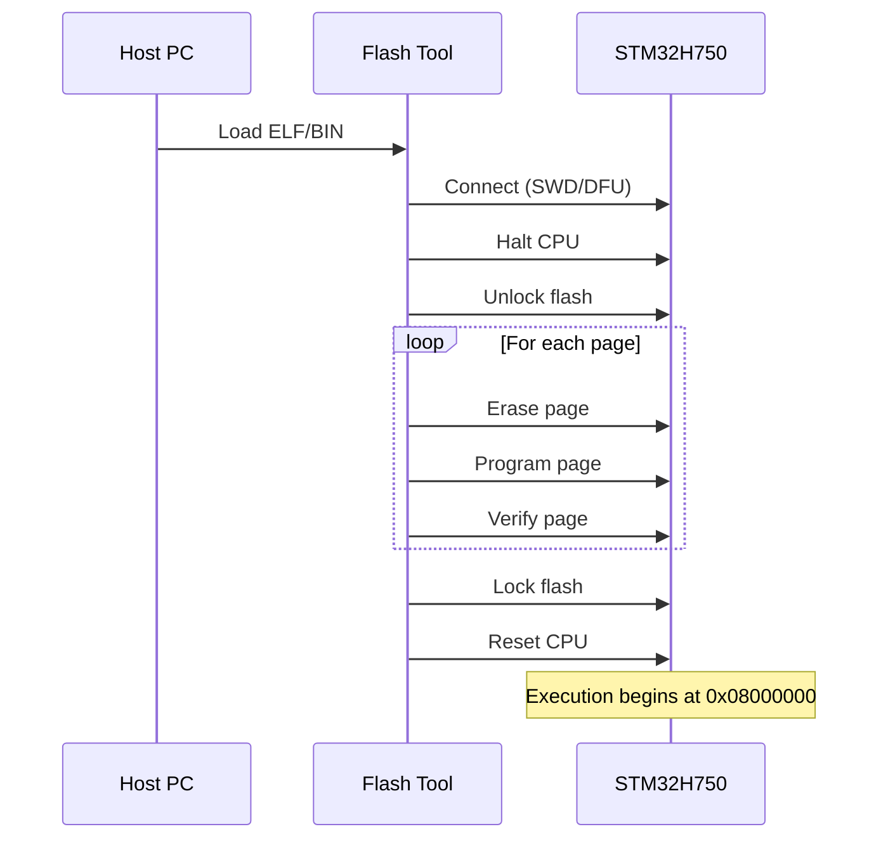

# Binary Formats & Flashing

After compilation, you have an executable binary. This document explains the binary formats used in embedded development and how they're loaded onto the microcontroller.

## ELF Format

Rust produces ELF (Executable and Linkable Format) files by default. ELF is a structured format containing:

```
┌─────────────────────────────────────┐
│           ELF Header                │  Magic number, architecture, entry point
├─────────────────────────────────────┤
│        Program Headers              │  How to load into memory
├─────────────────────────────────────┤
│          .text                      │  Executable code
├─────────────────────────────────────┤
│          .rodata                    │  Read-only data (constants)
├─────────────────────────────────────┤
│          .data                      │  Initialized variables
├─────────────────────────────────────┤
│          .bss                       │  Zero-initialized variables (size only)
├─────────────────────────────────────┤
│        Section Headers              │  Section metadata
├─────────────────────────────────────┤
│        Symbol Table                 │  Function/variable names and addresses
├─────────────────────────────────────┤
│        Debug Info                   │  DWARF debugging data
└─────────────────────────────────────┘
```

**What ELF Contains**:
- Code sections (`.text`)
- Data sections (`.rodata`, `.data`)
- Memory layout information (where to load each section)
- Debug symbols (function names, line numbers)
- Relocation information

**Why ELF is Useful**:
- Debug probes (probe-rs, OpenOCD) can parse it directly
- Debuggers use symbol information for breakpoints
- Size analysis tools can inspect sections

## BIN Format

BIN (binary) is raw machine code—exactly what gets written to flash memory. No headers, no metadata, just bytes.

```
┌─────────────────────────────────────┐
│     Raw machine code                │
│     Starting at address 0           │
│     Continuous bytes...             │
└─────────────────────────────────────┘
```

**Why BIN is Needed**:
- DFU flashing requires raw binary
- Simpler tools can't parse ELF
- Directly represents flash contents

## Converting ELF to BIN

Use `llvm-objcopy` (or `arm-none-eabi-objcopy`):

```bash
# Convert ELF to BIN
llvm-objcopy -O binary \
    target/thumbv7em-none-eabihf/release/my_app \
    target/thumbv7em-none-eabihf/release/my_app.bin

# Using ARM toolchain
arm-none-eabi-objcopy -O binary input.elf output.bin
```

**What Changes**:
- Debug info: Removed
- Symbol table: Removed
- Section headers: Removed
- Result: Pure machine code at addresses from linker script

## HEX Format (Intel HEX)

Some tools prefer Intel HEX format—an ASCII representation with address information:

```
:10000000FFFFFFFFFFFFFFFFFFFFFFFFFFFFFFFF00
:10001000FFFFFFFFFFFFFFFFFFFFFFFFFFFFFFFF F0
:020000040800F2
:1000000000200020E1010008E3010008E5010008BA
```

Each line contains:
- Start code (`:`)
- Byte count
- Address
- Record type
- Data
- Checksum

**Convert to HEX**:
```bash
llvm-objcopy -O ihex input.elf output.hex
```

## Size Analysis

Understanding binary size helps optimize for limited flash:

```bash
# Summary of section sizes
arm-none-eabi-size target/thumbv7em-none-eabihf/release/my_app

   text    data     bss     dec     hex filename
  45632     124    4096   49852    c2bc my_app
```

| Column | Description |
|--------|-------------|
| `text` | Code + read-only data (goes in flash) |
| `data` | Initialized variables (flash + RAM) |
| `bss` | Zero-initialized variables (RAM only) |
| `dec`/`hex` | Total |

**Flash usage**: `text + data`
**RAM usage**: `data + bss`

### Detailed Section Analysis

```bash
# List all sections with sizes
arm-none-eabi-objdump -h target/thumbv7em-none-eabihf/release/my_app

Idx Name          Size      VMA       LMA       File off  Algn
  0 .vector_table 00000400  08000000  08000000  00010000  2**2
  1 .text         0000a800  08000400  08000400  00010400  2**2
  2 .rodata       00001200  0800ac00  0800ac00  0001ac00  2**2
```

### Finding Large Symbols

```bash
# Sort symbols by size
arm-none-eabi-nm --size-sort -S target/thumbv7em-none-eabihf/release/my_app | tail -20

00000800 B DELAY_BUFFER
00000400 T audio_callback
00000200 T main
```

## Flash Memory Addresses

STM32H750 has multiple flash locations:

| Region | Address | Size | Speed | Use |
|--------|---------|------|-------|-----|
| Internal Flash | `0x08000000` | 128 KB | Fast | Boot code, main app |
| QSPI Flash | `0x90000000` | 8 MB | Slower | Extended code, data |

**Boot Sequence**:
1. After reset, CPU fetches vector table from `0x08000000`
2. Stack pointer loaded from first word
3. Reset handler address loaded from second word
4. Execution begins at reset handler

## Flashing Methods

### Method 1: Debug Probe (probe-rs)

Fastest and most reliable. Uses SWD (Serial Wire Debug) interface.

```bash
# Flash and reset
probe-rs run --chip STM32H750VBTx target/thumbv7em-none-eabihf/release/my_app

# Or use cargo runner (configured in .cargo/config.toml)
cargo run --release
```

**Probe Types**:
- ST-Link (built into Nucleo boards)
- J-Link
- CMSIS-DAP

**Advantages**:
- Can flash, debug, and profile
- Automatic ELF parsing
- Fast (parallel flash programming)

### Method 2: DFU (USB Bootloader)

No debug probe needed—just USB.

**Enter DFU Mode**:
1. Hold BOOT button
2. Press RESET button
3. Release RESET
4. Release BOOT

The device enumerates as a DFU device.

**Flash with dfu-util**:
```bash
# List DFU devices
dfu-util -l

# Flash to internal flash
dfu-util -a 0 -s 0x08000000:leave -D my_app.bin

# Flash to QSPI
dfu-util -a 0 -s 0x90000000:leave -D my_app.bin
```

**Options**:
- `-a 0`: Alternate setting (usually 0)
- `-s address:leave`: Target address, leave DFU mode after
- `-D file.bin`: Download (flash) this file

**Advantages**:
- No probe hardware needed
- Works over USB
- Built into STM32 ROM

**Disadvantages**:
- Requires manual button sequence
- Slower than SWD
- Can't debug

### Method 3: OpenOCD

Open-source debugger supporting many probes:

```bash
# Flash using ST-Link
openocd -f interface/stlink.cfg -f target/stm32h7x.cfg \
    -c "program my_app.elf verify reset exit"
```

## What Happens During Flashing



**Flash Programming Steps**:
1. **Unlock**: Flash is write-protected by default
2. **Erase**: Pages must be erased before writing (sets all bits to 1)
3. **Program**: Write data (can only clear bits, not set)
4. **Verify**: Read back and compare (optional but recommended)
5. **Lock**: Re-enable write protection

## Verifying a Flashed Binary

Read back flash contents and compare:

```bash
# Read flash to file
probe-rs read --chip STM32H750VBTx 0x08000000 128K readback.bin

# Compare
diff my_app.bin readback.bin && echo "Match!"
```

## Build Script Integration

Automate BIN creation in your build process:

```bash
#!/bin/bash
# build.sh

cargo build --release

# Convert to BIN
arm-none-eabi-objcopy -O binary \
    target/thumbv7em-none-eabihf/release/my_app \
    target/thumbv7em-none-eabihf/release/my_app.bin

# Print sizes
echo "=== Binary Size ==="
arm-none-eabi-size target/thumbv7em-none-eabihf/release/my_app
```

Or in `Cargo.toml` with a custom build command:

```toml
[package.metadata.cargo-flash]
chip = "STM32H750VBTx"
```

## Troubleshooting

### "Error: Flash write failed"

**Causes**:
- Flash locked or protected
- Target not halted
- Power issues

**Fixes**:
```bash
# Mass erase and try again
probe-rs erase --chip STM32H750VBTx
```

### "DFU device not found"

**Causes**:
- Not in DFU mode
- USB driver issues (Windows)

**Fixes**:
- Re-enter DFU mode (BOOT + RESET sequence)
- Install WinUSB driver via Zadig (Windows)

### "Binary too large for flash"

**Causes**:
- Code exceeds 128KB internal flash

**Fixes**:
- Enable LTO: `lto = "fat"`
- Optimize for size: `opt-level = "z"`
- Move code/data to QSPI

## Further Reading

- [Linker Scripts](linker-scripts.md) - How memory layout is defined
- [Toolchain](toolchain.md) - Compilation process
- [Troubleshooting](../troubleshooting.md) - Common build and flash issues
