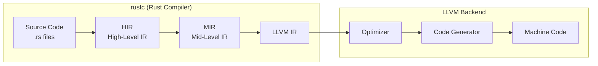
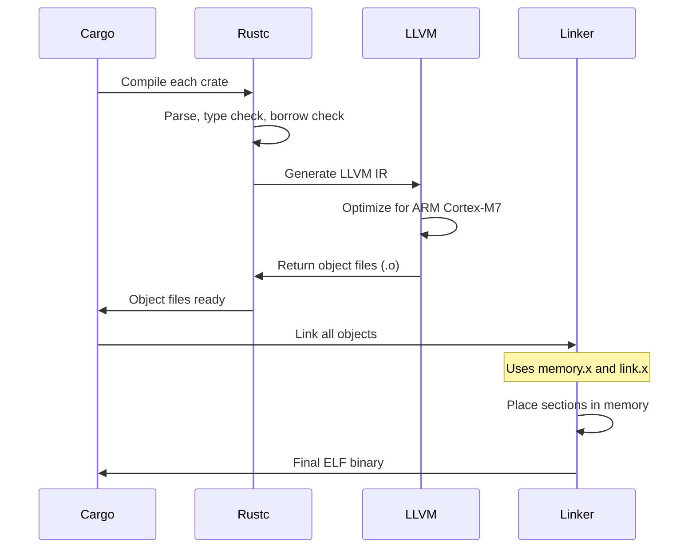

# Toolchain & LLVM

Understanding how Rust compiles code for embedded targets helps you troubleshoot build issues and make informed decisions about optimization. This document explains the compilation pipeline and target configuration.

## Compilation Pipeline

Rust code goes through several transformation stages before becoming machine code:



### Stage 1: Rust Frontend

**Source → HIR (High-Level IR)**:
- Macro expansion
- Name resolution
- Type checking
- Borrow checking

**HIR → MIR (Mid-Level IR)**:
- Control flow analysis
- Lifetime analysis
- Drop elaboration
- Optimization (inlining, constant folding)

### Stage 2: LLVM Backend

Rust uses LLVM for code generation. LLVM is a mature compiler infrastructure that handles:

**LLVM IR → Optimized IR**:
- Dead code elimination
- Loop optimizations
- Vectorization
- Architecture-specific optimizations

**Optimized IR → Machine Code**:
- Instruction selection
- Register allocation
- Instruction scheduling

### Why LLVM Matters

LLVM provides excellent code generation for ARM Cortex-M without the Rust team needing to implement it. The same LLVM backend that optimizes C/C++ for ARM handles Rust.

This means:
- Rust can target any architecture LLVM supports
- Optimizations benefit from decades of development
- Assembly quality matches C/C++ compilers

## Target Triples

A target triple specifies what kind of binary to produce. Embedded Daisy uses:

```
thumbv7em-none-eabihf
   │      │     │  └── Hard-float (hardware FPU)
   │      │     └───── Embedded ABI
   │      └─────────── No operating system
   └────────────────── ARM Thumb-2, Cortex-M4/M7 with DSP
```

### Breaking Down the Triple

**`thumbv7em`** - Architecture
- `thumb`: ARM Thumb instruction set (16/32-bit mixed)
- `v7`: ARMv7 architecture
- `e`: DSP extensions (SIMD instructions)
- `m`: Microcontroller profile (Cortex-M series)

The Cortex-M7 in STM32H750 supports this instruction set.

**`none`** - Operating System
- No OS, bare metal execution
- No system calls available
- No standard library (requires `#![no_std]`)

**`eabi`** - ABI (Application Binary Interface)
- Embedded Application Binary Interface
- Defines calling conventions, data layout
- How functions pass arguments and return values

**`hf`** - Float ABI
- Hard-float: FPU registers used for floating-point
- Alternative: `eabi` (soft-float, FPU emulated in software)

Always use `eabihf` for STM32H750—it has an FPU and you want to use it.

## Installing the Target

Add the embedded target to your Rust toolchain:

```bash
rustup target add thumbv7em-none-eabihf
```

Verify installation:

```bash
rustup target list | grep thumbv7em
# thumbv7em-none-eabi
# thumbv7em-none-eabihf (installed)
```

## FPU and Audio Performance

The STM32H750's FPU dramatically affects audio performance:

**With Hardware FPU (`eabihf`)**:
```rust
// Compiles to single FPU instruction
let result = a * b + c;  // VMLA.F32 or VFMA.F32
```

**Without FPU (soft-float)**:
```rust
// Compiles to library call (~50-100 cycles)
let result = a * b + c;  // __aeabi_fmul, __aeabi_fadd calls
```

**Performance Difference**: Hardware FPU is 10-50x faster for `f32` operations.

### FPU Capabilities

| Operation | Hardware Support | Performance |
|-----------|-----------------|-------------|
| f32 add/mul/div | Yes | ~1-15 cycles |
| f32 sqrt | Yes | ~14 cycles |
| f32 trigonometry | No | Software library |
| f64 operations | Partial | Emulated, slow |

For `sin`, `cos`, and other transcendentals, use `libm` which provides optimized software implementations.

## Cargo Configuration

Configure your project for embedded builds in `.cargo/config.toml`:

```toml
[build]
target = "thumbv7em-none-eabihf"

[target.thumbv7em-none-eabihf]
runner = "probe-run --chip STM32H750VBTx"

rustflags = [
    # Use the cortex-m-rt linker script
    "-C", "link-arg=-Tlink.x",
    # LTO for smaller binaries
    "-C", "lto=fat",
]

[unstable]
build-std = ["core", "alloc"]
```

### Key Options

**`build-std`**: Rebuilds core library with your target's optimizations. Required for embedded.

**`link-arg=-Tlink.x`**: Use cortex-m-rt's linker script. This sets up the vector table and memory layout.

**`lto=fat`**: Link-Time Optimization across all crates. Essential for embedded to:
- Eliminate unused code
- Inline across crate boundaries
- Produce smaller binaries

## Release Profile

Configure `Cargo.toml` for embedded:

```toml
[profile.release]
opt-level = 3        # Maximum optimization
lto = "fat"          # Link-time optimization
codegen-units = 1    # Better optimization (slower compile)
panic = "abort"      # Smaller binary, no unwinding
debug = 2            # Keep debug info for profiling

[profile.release.package."*"]
opt-level = "z"      # Optimize dependencies for size
```

**`panic = "abort"`**: Don't generate unwinding code. On embedded, panics should halt, not unwind.

**`opt-level`**: Use `3` for performance-critical code, `z` or `s` for size-constrained sections.

## Cross-Compilation Flow

Here's what happens when you run `cargo build --release`:



## Inspecting Generated Code

View the assembly generated for a function:

```bash
# Disassemble the binary
arm-none-eabi-objdump -d target/thumbv7em-none-eabihf/release/my_app > disassembly.txt

# Or use cargo-show-asm
cargo install cargo-show-asm
cargo asm --lib my_crate::audio::process
```

Check binary size:

```bash
arm-none-eabi-size target/thumbv7em-none-eabihf/release/my_app
#    text    data     bss     dec     hex filename
#   45632     124    4096   49852    c2bc my_app
```

## Troubleshooting

### "can't find crate for `std`"

You're compiling `no_std` code but a dependency requires `std`.

**Fix**: Ensure all dependencies support `no_std`:
```toml
[dependencies]
some_crate = { version = "1.0", default-features = false }
```

### "undefined reference to `__aeabi_*`"

Missing soft-float runtime functions.

**Fix**: Ensure you're using `eabihf` target and linking `libm` if needed.

### Binary too large for flash

**Fixes**:
- Enable LTO: `lto = "fat"`
- Use `opt-level = "z"` for size
- Remove unused dependencies
- Check for large static arrays

## Further Reading

- [Linker Scripts](linker-scripts.md) - Memory layout configuration
- [Binary Formats](binary-formats.md) - ELF, BIN, and flashing
- [STM32H750 MCU](../daisy-hardware/stm32h750.md) - Target hardware details
