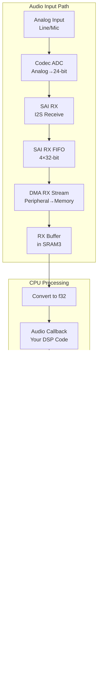

# Audio Interface

This document explains how audio flows through the Daisy hardware—from analog input to your DSP code and back to analog output. Understanding SAI, DMA, and codec interaction is essential for embedded audio development.

## Audio Signal Flow

```mermaid
flowchart LR
    subgraph Analog
        AIN[Audio In]
        AOUT[Audio Out]
    end

    subgraph Codec["Audio Codec"]
        CADC[ADC]
        CDAC[DAC]
    end

    subgraph I2S["I2S Bus"]
        RX[SAI RX]
        TX[SAI TX]
    end

    subgraph DMA
        DRXC[DMA RX<br/>Circular]
        DTXC[DMA TX<br/>Circular]
    end

    subgraph RAM
        RXBUF[RX Buffer<br/>A|B]
        TXBUF[TX Buffer<br/>A|B]
    end

    subgraph CPU
        ISR[Interrupt<br/>Handler]
        PROC[Audio<br/>Callback]
    end

    AIN --> CADC --> RX --> DRXC --> RXBUF
    RXBUF --> ISR --> PROC
    PROC --> TXBUF --> DTXC --> TX --> CDAC --> AOUT
```

## SAI (Serial Audio Interface)

SAI is the STM32H750's digital audio peripheral. It implements I2S and other audio protocols.

### I2S Protocol

I2S (Inter-IC Sound) uses four signals:

| Signal | Direction | Description |
|--------|-----------|-------------|
| MCLK | MCU → Codec | Master clock (256×Fs) |
| SCK/BCLK | MCU → Codec | Bit clock (64×Fs) |
| WS/LRCK | MCU → Codec | Word select / L-R clock (Fs) |
| SD/DATA | Bidirectional | Serial audio data |

**Timing Diagram**:
```
LRCK:  ____/‾‾‾‾‾‾‾‾‾‾‾‾\____________/‾‾‾‾‾‾‾‾‾‾‾‾\____
         LEFT CHANNEL      RIGHT CHANNEL     LEFT...

BCLK:  _/‾\_/‾\_/‾\_/‾\_/‾\_/‾\_/‾\_/‾\_/‾\_/‾\_/‾\_/‾\_

SD:    --<L31><L30>...<L0><R31><R30>...<R0><L31>...
         MSB first, 32 bits per channel
```

### SAI Configuration

The STM32H750 has two SAI peripherals (SAI1, SAI2), each with two subblocks (A, B).

```rust
// Typical SAI configuration for 48kHz stereo
let sai_config = SaiConfig {
    mode: Mode::Master,           // Generate clocks
    direction: Direction::Rx,      // or Tx
    protocol: Protocol::I2s,
    data_size: DataSize::Data32,   // 32-bit samples
    frame_length: 64,              // 32 bits × 2 channels
    active_frame_length: 32,       // Bits per channel
    fifo_threshold: FifoThreshold::Quarter,
};
```

### Master vs Slave

**Master Mode**: MCU generates all clocks. Codec follows.
```
MCU (Master) ──MCLK──> Codec (Slave)
             ──BCLK──>
             ──LRCK──>
             <──DATA──> (bidirectional)
```

**Slave Mode**: Codec generates clocks. MCU follows.
```
MCU (Slave)  <──MCLK── Codec (Master)
             <──BCLK──
             <──LRCK──
             <──DATA──> (bidirectional)
```

Most Daisy configurations use **master mode** with the MCU controlling timing.

## DMA Configuration

DMA (Direct Memory Access) transfers audio samples without CPU intervention.

### Circular Double-Buffer Mode

Audio uses circular DMA with two buffer halves:


**Why Double-Buffer?**

While CPU processes one half, DMA fills the other. No gaps in audio stream.

### DMA Stream Configuration

```rust
// DMA configuration for SAI RX
let dma_config = DmaConfig {
    transfer_type: TransferType::PeripheralToMemory,
    peripheral_address: &sai1.dr as *const _ as u32,
    memory_address: rx_buffer.as_ptr() as u32,
    buffer_size: BUFFER_SIZE * 2,  // Double buffer
    circular: true,
    priority: Priority::VeryHigh,
    memory_increment: true,
    peripheral_increment: false,
    half_transfer_interrupt: true,
    transfer_complete_interrupt: true,
};
```

**Key Settings**:
- `circular: true` - Automatically restart at buffer beginning
- `half_transfer_interrupt` - Fires when first half complete
- `transfer_complete_interrupt` - Fires when second half complete

### Buffer Placement

DMA buffers must be in DMA-accessible memory:

```rust
// WRONG: DTCM is not DMA accessible
static mut BUFFER: [i32; 256] = [0; 256];

// CORRECT: SRAM3 is in D2 domain, DMA accessible
#[link_section = ".sram3"]
static mut BUFFER: [i32; 256] = [0; 256];
```

## Audio Callback Timing

At 48 kHz with a 48-sample buffer:

```
Buffer period = 48 samples / 48000 Hz = 1 ms

Timeline:
0ms     1ms     2ms     3ms
|-------|-------|-------|
  Fill A  Fill B  Fill A
  Proc B  Proc A  Proc B
        ↑       ↑       ↑
     Int A   Int B   Int A
```

**Deadline**: Audio callback must complete before the next interrupt.

At 400 MHz:
- 1 ms = 400,000 CPU cycles
- ~8,333 cycles per sample

### Interrupt Handler

```rust
#[interrupt]
fn DMA1_STR0() {
    // Clear interrupt flags FIRST
    unsafe {
        let dma = &*DMA1::ptr();
        dma.lifcr.write(|w| w.ctcif0().clear());
    }

    // Determine which half is ready
    let half = if /* check HTIF */ {
        BufferHalf::First
    } else {
        BufferHalf::Second
    };

    // Get buffer slice
    let (input, output) = get_buffer_half(half);

    // Call user audio callback
    AUDIO_PROCESSOR.process(input, output);
}
```

**Critical**: Clear interrupt flags immediately or the handler fires repeatedly.

## Sample Format Conversion

### I2S Data Format

I2S transmits 32-bit words, but codecs vary in actual resolution:

| Codec | ADC Bits | DAC Bits | Format |
|-------|----------|----------|--------|
| AK4556 | 24 | 24 | Left-justified, MSB first |
| WM8731 | 24 | 24 | I2S standard |
| PCM3060 | 24 | 24 | I2S standard |

24-bit data in 32-bit word:
```
|31    24|23    16|15     8|7      0|
| Sample (24 bits)    | Padding    |
```

### Conversion to/from f32

```rust
// I2S 24-bit to f32 (-1.0 to 1.0)
fn i2s_to_f32(sample: i32) -> f32 {
    // Shift to get 24-bit signed value, then normalize
    (sample >> 8) as f32 / 8388608.0  // 2^23
}

// f32 to I2S 24-bit
fn f32_to_i2s(sample: f32) -> i32 {
    let clamped = sample.clamp(-1.0, 1.0);
    ((clamped * 8388607.0) as i32) << 8
}
```

## Cache Coherency

The Cortex-M7 D-Cache doesn't see DMA transfers:


### Solution 1: Cache Maintenance Operations

```rust
// Before DMA reads CPU-written data
cortex_m::asm::dsb();  // Complete all previous writes
// Clean (flush) cache lines for buffer
cache_clean(&output_buffer);

// Before CPU reads DMA-written data
cortex_m::asm::dsb();
// Invalidate cache lines for buffer
cache_invalidate(&input_buffer);
```

### Solution 2: Non-Cached Memory Region

Simpler approach—use memory that bypasses cache:

```rust
// Place in SRAM3, configure MPU to disable caching
#[link_section = ".sram3"]
static mut AUDIO_BUFFER: AudioBuffer = AudioBuffer::new();
```

Configure MPU (Memory Protection Unit):
```rust
// Mark SRAM3 as non-cacheable
let mpu = cortex_m::peripheral::MPU::steal();
// ... configure region as Device or Strongly-Ordered
```

`bbx_daisy` handles this automatically.

## Codec Configuration

Some codecs require I2C configuration before audio works.

### AK4556 (Daisy Seed Original)

No configuration needed—hardware-only codec. Audio works immediately after SAI setup.

### WM8731 (Daisy Seed 1.1, Pod)

Requires I2C initialization:

```rust
// WM8731 register writes
const WM8731_ADDR: u8 = 0x1A;

// Reset
i2c.write(WM8731_ADDR, &[0x1E, 0x00])?;

// Power on all sections
i2c.write(WM8731_ADDR, &[0x0C, 0x00])?;

// Configure digital audio interface
i2c.write(WM8731_ADDR, &[0x0E, 0x02])?;  // I2S, 24-bit

// Set sample rate
i2c.write(WM8731_ADDR, &[0x10, 0x00])?;  // Normal mode, 48kHz

// Activate interface
i2c.write(WM8731_ADDR, &[0x12, 0x01])?;
```

### PCM3060 (Daisy Seed 1.2, Patch)

Similar I2C setup required:

```rust
const PCM3060_ADDR: u8 = 0x46;

// System control - normal operation
i2c.write(PCM3060_ADDR, &[0x40, 0xC0])?;

// DAC control
i2c.write(PCM3060_ADDR, &[0x41, 0x00])?;

// ADC control
i2c.write(PCM3060_ADDR, &[0x42, 0x00])?;
```

## Complete Data Flow Diagram



## Troubleshooting

### No Audio Output

1. Check codec power and I2C configuration
2. Verify SAI clock configuration
3. Ensure DMA is running (check DMA registers)
4. Check buffer addresses are in DMA-accessible memory

### Audio Glitches/Clicks

1. Audio callback taking too long
2. Cache coherency issues
3. Interrupt priority conflicts
4. Buffer underrun/overrun

### Wrong Sample Rate

1. Verify PLL3 configuration
2. Check SAI clock dividers
3. Ensure codec is configured for same rate

### Distorted Audio

1. Clipping—reduce gain
2. Sample format mismatch
3. Endianness issues
4. DC offset

## Further Reading

- [Clock Tree](clock-tree.md) - Audio clock generation
- [STM32H750 MCU](stm32h750.md) - Memory regions and DMA
- [Memory Model](../fundamentals/memory-model.md) - Buffer placement
- [Hardware Peripherals](../fundamentals/hardware-peripherals.md) - DMA and SAI basics
