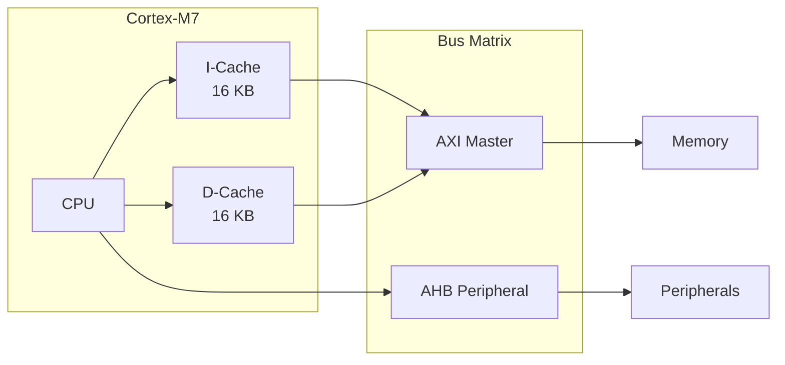
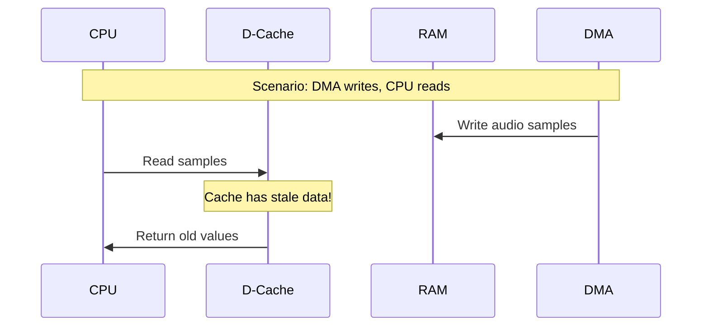
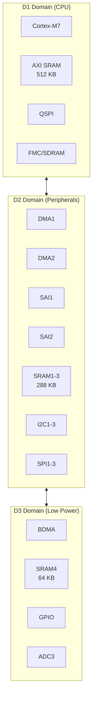
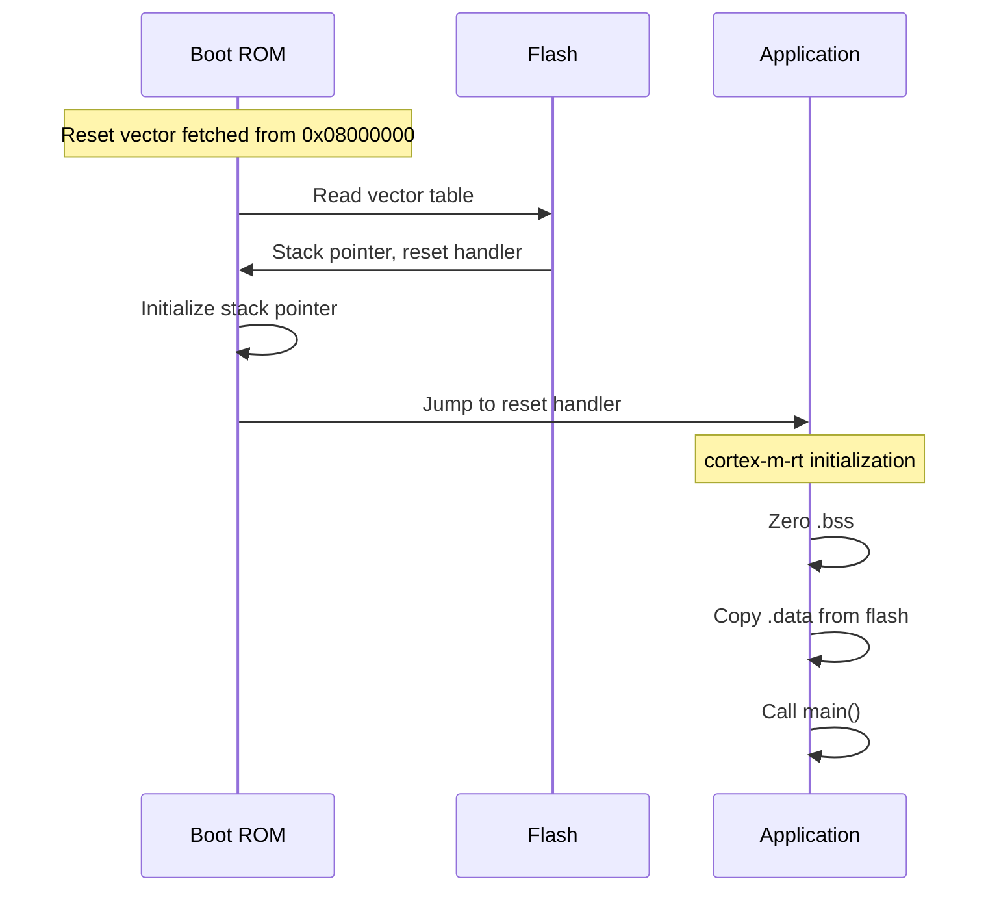

# STM32H750 MCU

The STM32H750 is the microcontroller at the heart of all Daisy boards. Understanding its architecture helps you write efficient audio code and debug issues.

## Overview

| Specification | Value |
|--------------|-------|
| Core | ARM Cortex-M7 |
| Max Frequency | 480 MHz |
| Operating Frequency | 400 MHz (Daisy default) |
| Internal Flash | 128 KB |
| Total SRAM | 1 MB |
| FPU | Single-precision hardware |
| DSP Instructions | Yes (SIMD) |
| Cache | 16 KB I-Cache, 16 KB D-Cache |

## ARM Cortex-M7 Core

The Cortex-M7 is a high-performance microcontroller core:

**Pipeline**: 6-stage superscalar pipeline
- Fetches and decodes multiple instructions
- Branch prediction reduces stalls
- Single-cycle multiply-accumulate (MAC)

**DSP Extensions**: SIMD (Single Instruction Multiple Data)
- Process two 16-bit values or four 8-bit values simultaneously
- Saturating arithmetic (clamps instead of overflowing)
- Useful for audio with proper data alignment

## FPU Capabilities

The Cortex-M7 FPU handles single-precision floating-point in hardware:

| Operation | Cycles | Notes |
|-----------|--------|-------|
| VADD.F32 | 1 | Add |
| VMUL.F32 | 1 | Multiply |
| VFMA.F32 | 1 | Fused multiply-add |
| VDIV.F32 | 14 | Division |
| VSQRT.F32 | 14 | Square root |

**Double-Precision**: The FPU has limited f64 support. Most operations are emulated in software—avoid double precision in audio code.

**Denormals**: Very small floating-point numbers cause FPU stalls. bbx_audio uses flush-to-zero mode:

```rust
// In initialization code
unsafe {
    // Set FZ (Flush-to-Zero) and DN (Default NaN) bits in FPCSR
    let fpcsr = core::arch::arm::__get_FPCSR();
    core::arch::arm::__set_FPCSR(fpcsr | (1 << 24) | (1 << 25));
}
```

## Cache Architecture

The Cortex-M7 has separate instruction and data caches:



### Cache Benefits

Without cache, every memory access goes to SRAM (2-4 wait states) or flash (6+ wait states). With cache:
- First access: Full latency (cache miss)
- Subsequent accesses: 0 wait states (cache hit)

**Audio Performance**: Frequently-accessed filter coefficients and oscillator wavetables benefit significantly from caching.

### Cache Coherency Problem

DMA transfers bypass the cache. This creates coherency issues:



**Solution**: Cache maintenance operations:

```rust
// Before reading DMA-written data
cortex_m::asm::dsb();  // Data synchronization barrier
// Invalidate cache lines for buffer region
// (implementation depends on HAL)

// Before DMA reads CPU-written data
// Clean (flush) cache lines
cortex_m::asm::dsb();
```

**Alternative**: Place DMA buffers in non-cached memory (SRAM3):

```rust
#[link_section = ".sram3"]  // Not cached
static mut DMA_BUFFER: [f32; 256] = [0.0; 256];
```

## Power Domains

The STM32H750 has three power domains that affect peripheral availability:



**Why This Matters for Audio**:

SAI and DMA1/DMA2 are in D2 domain. DMA buffers must be in D2-accessible memory:
- SRAM1 ✓
- SRAM2 ✓
- SRAM3 ✓ (recommended)
- DTCM ✗ (D1 only, not DMA accessible)
- AXI SRAM ✗ (D1 only, needs MDMA)

## Memory Architecture

The STM32H750 has multiple memory types optimized for different uses:

### DTCM (Data Tightly Coupled Memory)
- **Size**: 128 KB
- **Address**: 0x20000000
- **Speed**: Zero wait state
- **DMA**: Not accessible
- **Use for**: Stack, performance-critical variables

### AXI SRAM
- **Size**: 512 KB
- **Address**: 0x24000000
- **Speed**: Fast with cache
- **DMA**: Accessible via MDMA
- **Use for**: General application data

### SRAM1-3 (D2 Domain)
- **Size**: 128 + 128 + 32 KB
- **Address**: 0x30000000 - 0x30047FFF
- **Speed**: Fast
- **DMA**: Accessible via DMA1/DMA2
- **Use for**: Audio DMA buffers

### SRAM4 (D3 Domain)
- **Size**: 64 KB
- **Address**: 0x38000000
- **Speed**: Fast
- **DMA**: Accessible via BDMA
- **Use for**: Low-power domain data

### External SDRAM
- **Size**: 64 MB (Daisy)
- **Address**: 0xC0000000
- **Speed**: Slowest
- **DMA**: Accessible
- **Use for**: Large buffers, sample data

## Clock System Overview

The STM32H750 has a complex clock tree for flexibility:

```
HSE (16 MHz crystal)
    │
    ├── PLL1 → System Clock (400 MHz)
    │          └── CPU, AHB, APB buses
    │
    ├── PLL2 → Peripheral clocks
    │
    └── PLL3 → SAI clocks (audio)
               └── 12.288 MHz (48 kHz) or 24.576 MHz (96 kHz)
```

See [Clock Tree](clock-tree.md) for detailed configuration.

## Peripheral Overview

Key peripherals for audio applications:

| Peripheral | Count | Use |
|------------|-------|-----|
| SAI | 2 (4 subblocks) | I2S audio interface |
| DMA | 2 controllers | Memory transfers |
| I2C | 4 | Codec configuration |
| SPI | 6 | External devices |
| QSPI | 1 | External flash |
| FMC | 1 | SDRAM interface |
| ADC | 3 | Analog inputs (knobs, CV) |
| DAC | 2 | Analog outputs |
| TIM | Many | Timing, PWM |

## Why 400 MHz Instead of 480 MHz?

The STM32H750 is rated for 480 MHz, but Daisy runs at 400 MHz because:

1. **Stability**: Higher frequencies require more careful power supply design
2. **Heat**: Less thermal load
3. **Margin**: Room for temperature variation
4. **Sufficient**: 400 MHz is plenty for audio processing

At 400 MHz with 48 kHz / 48-sample buffers:
- ~8300 cycles per sample
- ~400,000 cycles per buffer (1 ms)

That's more than enough for complex DSP.

## Boot Process

After power-on or reset:



The boot ROM can also enter DFU mode if BOOT pin is held during reset.

## Further Reading

- [Clock Tree](clock-tree.md) - PLL configuration for audio
- [Audio Interface](audio-interface.md) - SAI and DMA setup
- [Memory Model](../fundamentals/memory-model.md) - Using the memory regions
