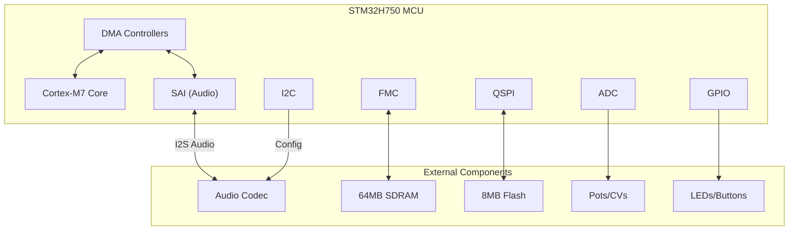
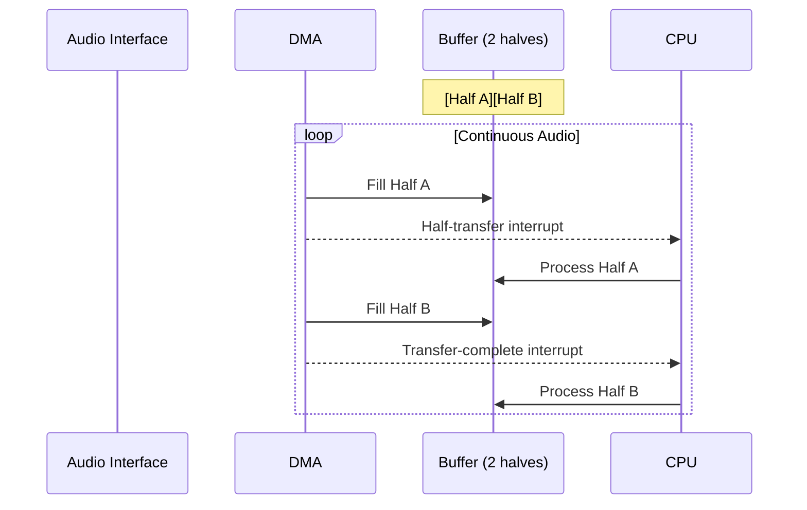
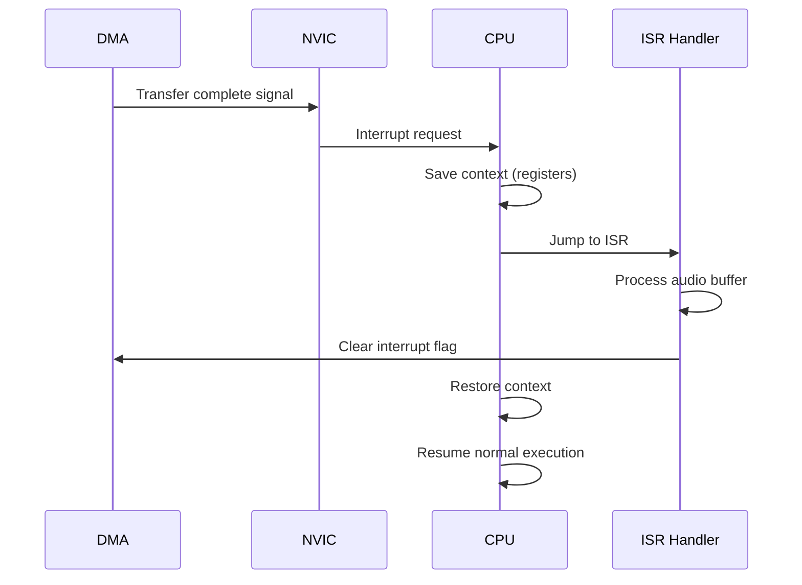
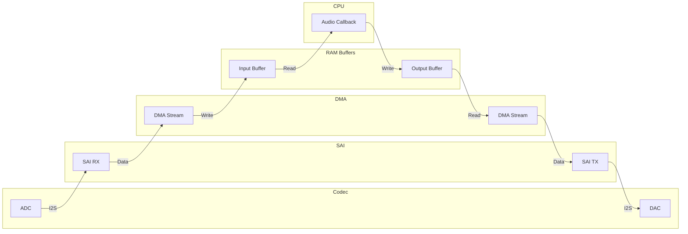

# Hardware Peripherals

Embedded systems communicate with the outside world through peripherals—hardware modules built into the microcontroller. This glossary explains the peripherals relevant to Daisy audio development.

## Peripheral Overview



## GPIO - General Purpose Input/Output

GPIO pins are the most basic peripheral—digital signals you can read or write.

**Output Modes**:
- **Push-Pull**: Actively drives high (3.3V) or low (0V). Use for LEDs.
- **Open-Drain**: Only pulls low; requires external pull-up for high. Use for shared buses.

**Input Modes**:
- **Floating**: No internal resistor. External circuit determines state.
- **Pull-Up**: Internal resistor pulls high when nothing connected.
- **Pull-Down**: Internal resistor pulls low when nothing connected.

```rust
// Configure LED output
let mut led = gpioc.pc7.into_push_pull_output();
led.set_high();

// Configure button input with pull-up
let button = gpiob.pb8.into_pull_up_input();
if button.is_low() {
    // Button pressed (connects to ground)
}
```

**Alternate Functions**: Most pins can serve multiple roles. The same pin might be GPIO, I2C data, or SAI clock depending on configuration.

## DMA - Direct Memory Access

DMA controllers move data between memory and peripherals without CPU involvement. This is critical for audio streaming.

**Why DMA Matters for Audio**:

Without DMA, the CPU would need to:
1. Read each sample from the SAI data register
2. Store it in RAM
3. Repeat for every sample, thousands of times per second

With DMA:
1. Configure source (SAI) and destination (RAM buffer)
2. DMA moves samples automatically
3. CPU is free to process audio

**Circular Mode**: For continuous audio, DMA operates in circular mode with double-buffering:



**DMA Streams and Channels**: The STM32H750 has two DMA controllers with multiple streams. Each stream can connect to specific peripherals via channel selection.

## SAI - Serial Audio Interface

SAI handles digital audio communication with external codecs using the I2S protocol.

**I2S Signal Lines**:

| Signal | Name | Description |
|--------|------|-------------|
| MCLK | Master Clock | Base clock, typically 256×Fs |
| BCLK/SCK | Bit Clock | One pulse per bit, 64×Fs for stereo 32-bit |
| LRCK/WS | Word Select | Left/right channel indicator, toggles at Fs |
| SD | Serial Data | Audio samples, MSB first |

**Timing Example (48 kHz)**:
- MCLK = 12.288 MHz (256 × 48,000)
- BCLK = 3.072 MHz (64 × 48,000)
- LRCK = 48 kHz (sample rate)

**Master vs Slave**:
- **Master**: MCU generates clocks, codec follows
- **Slave**: Codec generates clocks, MCU follows

Most Daisy configurations run SAI as master with the codec as slave.

## I2C - Inter-Integrated Circuit

I2C is a two-wire protocol for configuring codecs and other peripherals.

**Signals**:
- **SDA**: Serial Data (bidirectional)
- **SCL**: Serial Clock (master drives)

**Communication**:
```
START | Address | R/W | ACK | Data | ACK | ... | STOP
```

```rust
// Write to codec register
let codec_addr = 0x1A;  // 7-bit address
let register = 0x04;    // Volume control
let value = 0x60;       // -6dB

i2c.write(codec_addr, &[register, value])?;
```

**Pull-Up Resistors**: I2C lines are open-drain and require pull-ups (typically 4.7kΩ). Daisy boards include these.

## ADC - Analog-to-Digital Converter

ADCs read analog voltages (knobs, CV inputs) and convert them to digital values.

**STM32H750 ADC Features**:
- 16-bit resolution
- Multiple channels (multiplexed)
- Can be triggered by timer or software

**Typical Usage**:
```rust
// Read knob position (0.0 to 1.0)
let raw = adc.read(&mut knob_pin)?;  // 0-65535
let normalized = raw as f32 / 65535.0;
```

**Smoothing**: ADC readings are noisy. Apply filtering:
```rust
// Simple exponential smoothing
smoothed = smoothed * 0.99 + raw * 0.01;
```

## QSPI - Quad SPI Flash

QSPI connects external NOR flash memory for code and data storage.

**Why External Flash**:
The STM32H750 has only 128KB internal flash—not enough for most programs. External QSPI flash provides 8MB, mapped to address space at `0x90000000`.

**Memory-Mapped Execution**: Code can execute directly from QSPI flash (XIP - Execute In Place), though it's slower than internal flash.

## FMC - Flexible Memory Controller

FMC interfaces with external SDRAM for additional data storage.

**Daisy SDRAM**:
- 64MB at `0xC0000000`
- Used for large audio buffers, delay lines, sample data
- Slower than internal SRAM but much larger

```rust
#[link_section = ".sdram"]
static mut DELAY_BUFFER: [f32; 2_000_000] = [0.0; 2_000_000];
```

## ISR - Interrupt Service Routine

ISRs are functions that run in response to hardware events.

**Audio Interrupt Flow**:


**ISR Rules**:
1. Keep it short—you're blocking other interrupts
2. No heap allocation
3. No blocking operations (waiting, sleeping)
4. Clear interrupt flags or it fires repeatedly

## NVIC - Nested Vectored Interrupt Controller

The NVIC manages interrupt priorities and delivery.

**Priority Levels**: Lower number = higher priority. Audio interrupts should be high priority (low number) to prevent glitches.

**Nesting**: A higher-priority interrupt can preempt a lower-priority one.

```rust
// Set DMA interrupt to high priority
unsafe {
    let mut nvic = cortex_m::Peripherals::steal().NVIC;
    nvic.set_priority(Interrupt::DMA1_STR0, 1);  // Priority 1 (high)
}
```

## Data Flow: Audio Input to Output

Here's how audio flows through the system:



1. **Analog input** → Codec ADC converts to digital
2. **Codec** → Sends I2S data to SAI
3. **SAI RX** → Receives serial audio data
4. **DMA** → Transfers samples to RAM buffer
5. **Interrupt** → Signals CPU when buffer ready
6. **Audio Callback** → Your code processes samples
7. **DMA** → Transfers output buffer to SAI TX
8. **SAI TX** → Sends I2S data to codec
9. **Codec DAC** → Converts to analog output

## Further Reading

- [Memory Model](memory-model.md) - Where buffers live in RAM
- [Audio Interface](../daisy-hardware/audio-interface.md) - Detailed SAI and DMA configuration
- [Clock Tree](../daisy-hardware/clock-tree.md) - How audio clocks are generated
