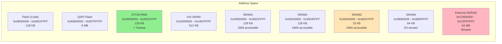
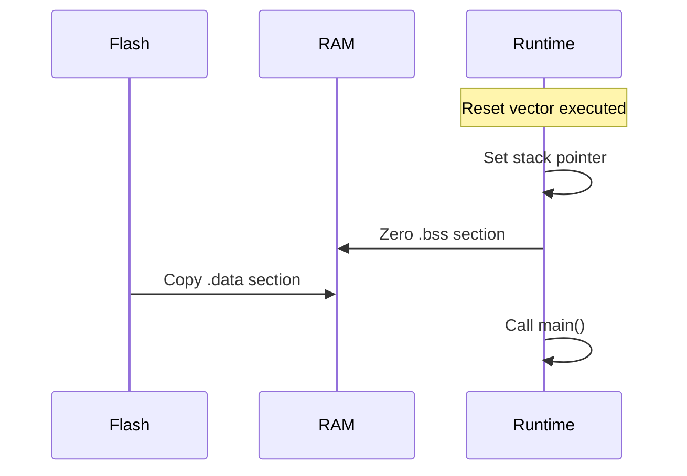

# Memory Model

Embedded systems have a fundamentally different memory model than desktop applications. There's no operating system managing memory, no virtual addresses, and no dynamic heap by default. Understanding where your data lives is essential for embedded audio development.

## Memory Regions Overview

The STM32H750 has multiple memory regions, each with different characteristics:



| Region | Size | Speed | DMA | Typical Use |
|--------|------|-------|-----|-------------|
| DTCM | 128 KB | Fastest | No | Stack, hot data |
| AXI SRAM | 512 KB | Fast | Yes | General variables |
| SRAM1-3 | 288 KB | Fast | Yes | Audio DMA buffers |
| SRAM4 | 64 KB | Fast | Yes | D3 domain data |
| SDRAM | 64 MB | Slow | Yes | Large buffers, samples |

## Stack Allocation

The stack holds local variables and function call frames. Unlike desktop systems where the OS manages stack size, embedded stacks have a fixed size defined in the linker script.

**Default Stack Location**: DTCM (fastest RAM)

```rust
// These live on the stack
fn process_audio() {
    let buffer: [f32; 64] = [0.0; 64];      // 256 bytes on stack
    let coefficient: f32 = 0.5;              // 4 bytes on stack
    // Automatically deallocated when function returns
}
```

**Stack Overflow**: If you exceed the stack size, behavior is undefined. You might overwrite other memory, causing silent corruption or hard faults.

```rust
// Dangerous: Large stack allocation
fn bad_idea() {
    let huge: [f32; 100_000] = [0.0; 100_000];  // 400KB - stack overflow!
}

// Better: Use static allocation
static mut HUGE_BUFFER: [f32; 100_000] = [0.0; 100_000];
```

## Static Allocation

`static` variables exist for the program's entire lifetime at fixed addresses.

```rust
// Initialized data (.data section) - copied from flash at startup
static COEFFICIENTS: [f32; 4] = [0.25, 0.5, 0.75, 1.0];

// Uninitialized data (.bss section) - zeroed at startup
static mut DELAY_LINE: [f32; 1024] = [0.0; 1024];
```

**Mutability**: `static mut` requires `unsafe` to access because the compiler can't verify exclusive access:

```rust
// Safe wrapper using a cell or atomic
use core::cell::UnsafeCell;

struct AudioBuffer {
    data: UnsafeCell<[f32; 256]>,
}

// Or use cortex_m critical sections
static mut BUFFER: [f32; 256] = [0.0; 256];

cortex_m::interrupt::free(|_| {
    unsafe { BUFFER[0] = 1.0; }
});
```

## Linker Sections

The linker organizes code and data into sections placed at specific addresses.

### Standard Sections

| Section | Contents | Location |
|---------|----------|----------|
| `.text` | Executable code | Flash |
| `.rodata` | Read-only data (const) | Flash |
| `.data` | Initialized static variables | RAM (copied from flash) |
| `.bss` | Zero-initialized static variables | RAM (zeroed at startup) |
| `.stack` | Stack space | DTCM |

### Custom Sections for Audio

Audio buffers used with DMA must be in DMA-accessible memory:

```rust
// Place in SRAM3 (DMA-accessible, D2 domain)
#[link_section = ".sram3"]
static mut DMA_BUFFER: [f32; 512] = [0.0; 512];

// Place in external SDRAM for large buffers
#[link_section = ".sdram"]
static mut SAMPLE_DATA: [f32; 1_000_000] = [0.0; 1_000_000];
```

The linker script defines these custom sections:

```ld
/* memory.x */
MEMORY {
    FLASH  : ORIGIN = 0x08000000, LENGTH = 128K
    DTCM   : ORIGIN = 0x20000000, LENGTH = 128K
    SRAM3  : ORIGIN = 0x30040000, LENGTH = 32K
    SDRAM  : ORIGIN = 0xC0000000, LENGTH = 64M
}

SECTIONS {
    .sram3 (NOLOAD) : ALIGN(4) {
        *(.sram3 .sram3.*);
    } > SRAM3

    .sdram (NOLOAD) : ALIGN(4) {
        *(.sdram .sdram.*);
    } > SDRAM
}
```

## Memory Initialization

At startup, before `main()` runs, the runtime initializes memory:



1. **Stack pointer**: Set to end of stack region
2. **`.bss` zeroing**: All zero-initialized statics set to 0
3. **`.data` copying**: Initialized statics copied from flash to RAM
4. **`main()` called**: Your code runs

## Why No Heap by Default

Desktop programs use heap allocation (`Box`, `Vec`, `String`) freely. Embedded systems typically avoid heaps because:

**1. Non-deterministic timing**: Allocation time varies. A `malloc` during audio processing could cause glitches.

**2. Fragmentation**: After many allocations/frees, memory becomes fragmented. You might have 10KB free but can't allocate 1KB contiguously.

**3. Limited memory**: When you only have 128KB total, heap overhead matters.

### Alternatives to Heap Allocation

**Const Generics**: Size known at compile time:
```rust
struct Filter<const N: usize> {
    coefficients: [f32; N],
}

let lpf = Filter::<8>::new();  // 8-tap filter, stack allocated
```

**Arena Allocators**: Pre-allocate a chunk, allocate linearly:
```rust
static mut ARENA: [u8; 4096] = [0; 4096];
static ARENA_OFFSET: AtomicUsize = AtomicUsize::new(0);

fn arena_alloc<T>(value: T) -> &'static mut T {
    // Bump allocator - never frees
    let offset = ARENA_OFFSET.fetch_add(size_of::<T>(), Ordering::Relaxed);
    unsafe {
        let ptr = ARENA.as_mut_ptr().add(offset) as *mut T;
        ptr.write(value);
        &mut *ptr
    }
}
```

**Static Arrays with Length Tracking**:
```rust
struct StaticVec<T, const CAP: usize> {
    data: [MaybeUninit<T>; CAP],
    len: usize,
}
```

## Memory Map Diagram

Here's how a typical bbx_daisy application uses memory:

```
Address         Region          Contents
─────────────────────────────────────────────────
0x08000000 ┬── FLASH ──────┬── Vector table
           │    128 KB     │── .text (code)
           │               │── .rodata (constants)
0x0801FFFF ┴───────────────┴── Copy of .data

0x20000000 ┬── DTCM ───────┬── .stack (grows down)
           │    128 KB     │
           │               │── (unused)
           │               │── .bss (zero-init)
0x2001FFFF ┴───────────────┴── .data (init statics)

0x24000000 ┬── AXI SRAM ───┬── Application data
           │    512 KB     │── Filter states
0x2407FFFF ┴───────────────┴── etc.

0x30040000 ┬── SRAM3 ──────┬── DMA RX buffer
           │    32 KB      │── DMA TX buffer
0x30047FFF ┴───────────────┴──

0x90000000 ┬── QSPI Flash ─┬── Extended code
           │    8 MB       │── Wavetables
0x907FFFFF ┴───────────────┴── Sample data

0xC0000000 ┬── SDRAM ──────┬── Delay lines
           │    64 MB      │── Sample buffers
0xC3FFFFFF ┴───────────────┴── Large data
```

## Common Memory Issues

### Stack Overflow
**Symptom**: Hard fault, random crashes
**Cause**: Too many/large local variables
**Fix**: Increase stack size or use static allocation

### DMA Buffer in Wrong Region
**Symptom**: Audio glitches, corrupt data
**Cause**: DMA buffer in non-DMA-accessible memory (DTCM)
**Fix**: Use `#[link_section = ".sram3"]`

### Cache Coherency
**Symptom**: DMA reads stale data
**Cause**: CPU cache not flushed before DMA read
**Fix**: Use cache maintenance operations or place buffers in non-cached region

## Further Reading

- [Linker Scripts](../compilation/linker-scripts.md) - Defining memory regions
- [STM32H750 MCU](../daisy-hardware/stm32h750.md) - Detailed memory architecture
- [Audio Interface](../daisy-hardware/audio-interface.md) - DMA buffer requirements
